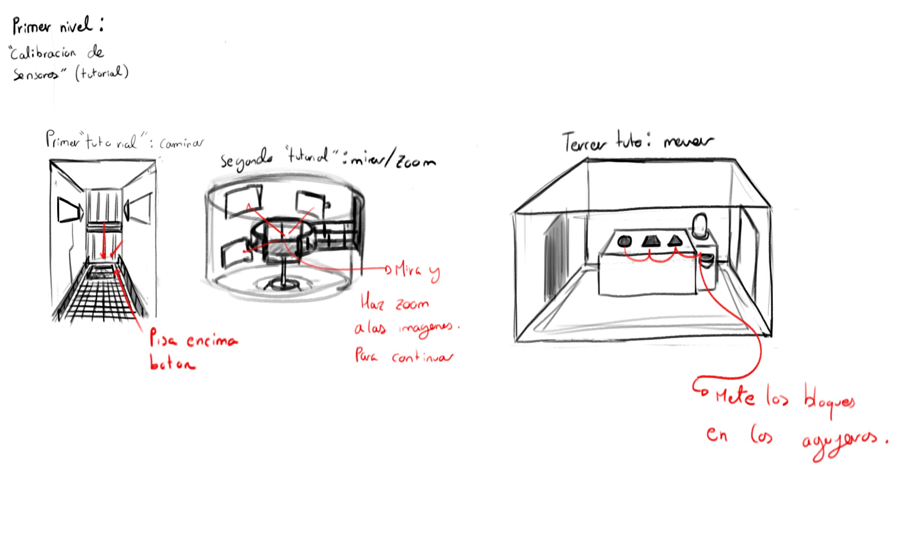
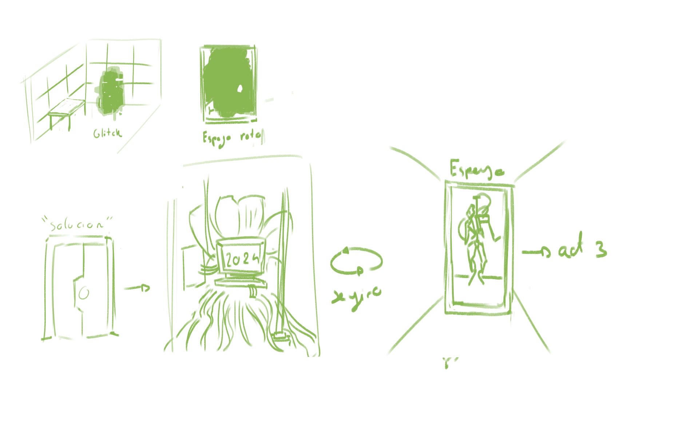

# project-fraus

# Codebase
## Pickup Objects
El jugador está constantemente lanzando raycasts. Si impacta con un objeto que implemente "pickable", esto se mostrará con un shader,
y si el jugador presiona la tecla de interacción, podrá cogerlo. Esto implica que la posición del objeto lerpeará a una posición
específica delante del jugador. Estos objetos serán del tipo "Rigidbody". Al tenerlos sostenidos, su gravedad se apagará.
# gdd

